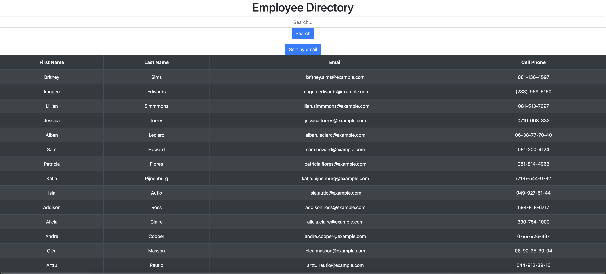
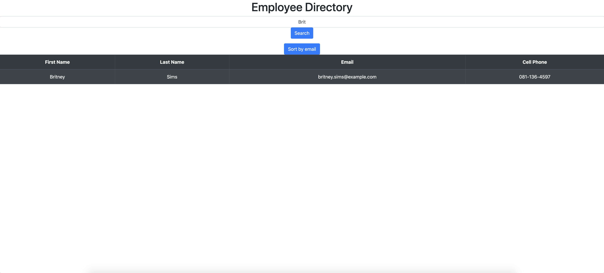

# React Directory

## Table of Contents
* [Installation](#installation)
* [Description](#description)
* [Contribution](#contribution)
* [Contact](#contact)

## Installation

No installation required. Users will be directed to the GitHub Pages link listed below or on the repo page, which brings you to a live website. Users will be able to search for users based on the search field or be able to sort by email.

## Description

The React Directory is a place for a business to store relevant information about employees in an easy-to-search table. If someone who wishes to use the app logs on, they can search for a specific individual by all or part of their name, email, or cell number. If the user is not sure who they are looking for they can search by alphabetical order the employees' emails.

## Contribution

If you think you can add functionality to this project, see a bug, or have styling suggestions, please feel free to message me through one of my contact options listed below.

# Contact

* Email: evanfurniss@gmail.com
* LinkedIn: https://www.linkedin.com/in/evan-furniss-03894b1bb/
* GitHub: https://github.com/evanfurniss

## Demo

Live app: https://evanfurniss.github.io/react-directory/

Live repo: https://github.com/evanfurniss/react-directory

